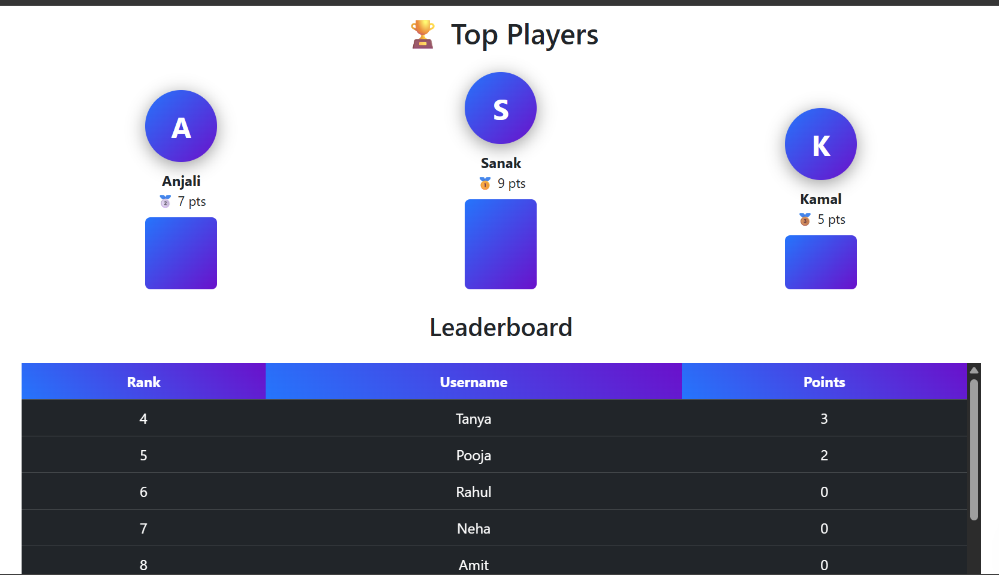
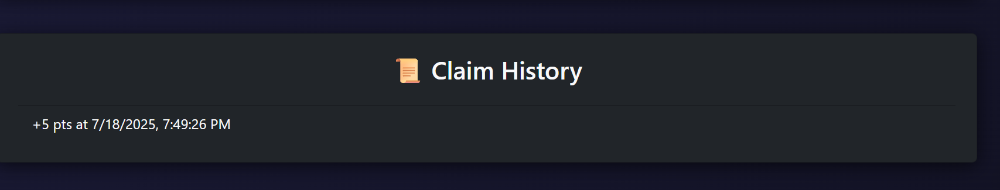

# LeaderBoard-Task
# 🎯 Claim Points App

A fun and interactive leaderboard app where users can claim points, view their ranking in real-time, and track claim history.

Built with **React**, **Framer Motion**, **Node.js**, and **MongoDB**.

---

## 🚀 Features

- 👤 User selection and creation
- ✅ Claim points with one click
- 🏆 Dynamic leaderboard with animated transitions
- 🕓 Claim history per user
- ✨ Smooth UI with animations using Framer Motion
- 🌈 Responsive and modern UI with dark theme

---

## 📸 Screenshots

| User Selection | Leaderboard | Claim Animation |
|----------------|-------------|------------------|
|  |  |  |

---

## 🛠️ Tech Stack

- **Frontend**: React, Framer Motion, Bootstrap
- **Backend**: Node.js, Express
- **Database**: MongoDB Atlas
- **Deployment**: Vercel (frontend), Render/Glitch (backend)

---

## 📦 Setup Instructions

### 🔧 Backend Setup

```bash
git clone https://github.com/your-username/claim-points-app.git
cd claim-points-app/backend
npm install
